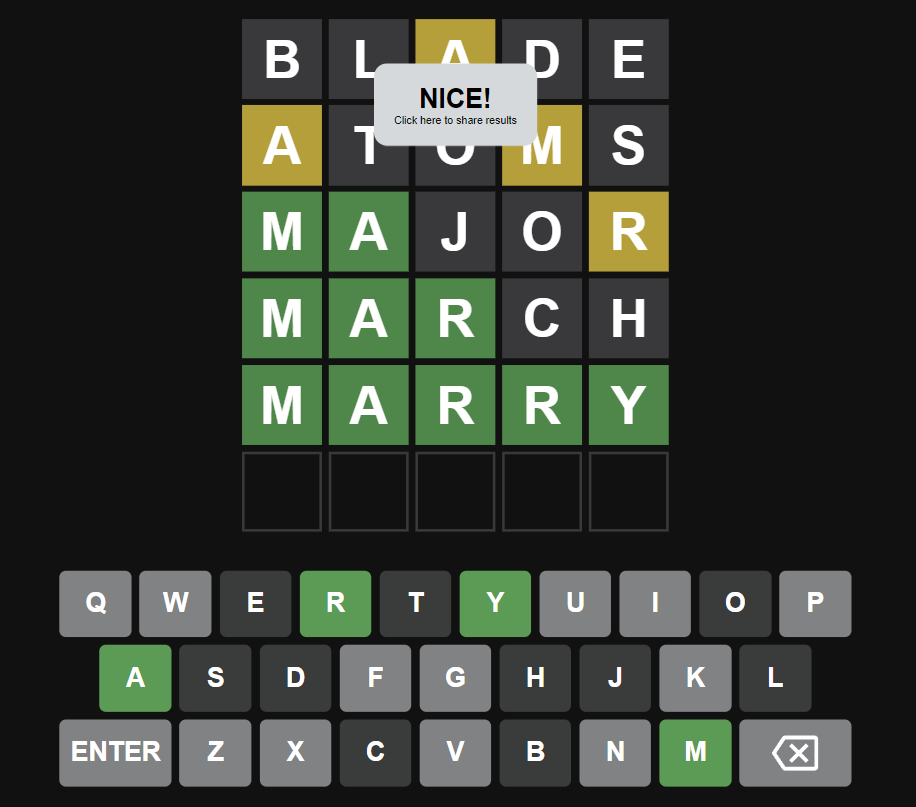

# Wordle Clone

In this project, I used `Javascript`, `HTML` and `CSS` to recreate the famous Wordle game.

## Live Demo

You can try the game yourself at:
https://ysyassine.github.io/Wordle-Clone/

## How to play

You have to guess a word in a maximum of 6 tries. Each guess must be a valid 5-letter word. The color of the tiles will change to show how close your guess was to the word:

- **_Correct letters_** in the right place will turn green.
  
- **_Correct letters_** in the **_wrong place_** will turn yellow.
  
- **_Incorrect letters_** will remain black.
  

Every day there is a new word to guess. You can share your score by pressing the notification displayed after you finish playing.

    Wordle Clone 255 5/6

    ⬛⬛🟨⬛⬛
    🟨⬛⬛🟨⬛
    🟩🟩⬛⬛🟨
    🟩🟩🟩⬛⬛
    🟩🟩🟩🟩🟩
    Play at: https://ysyassine.github.io/Wordle-Clone/
